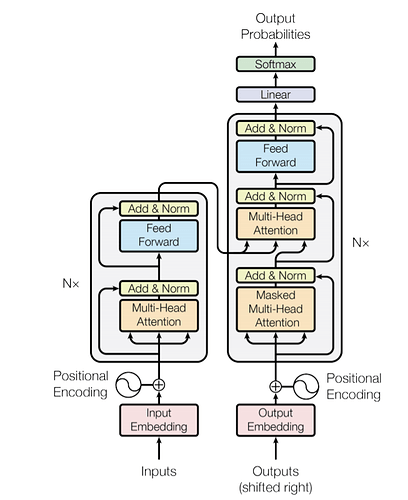
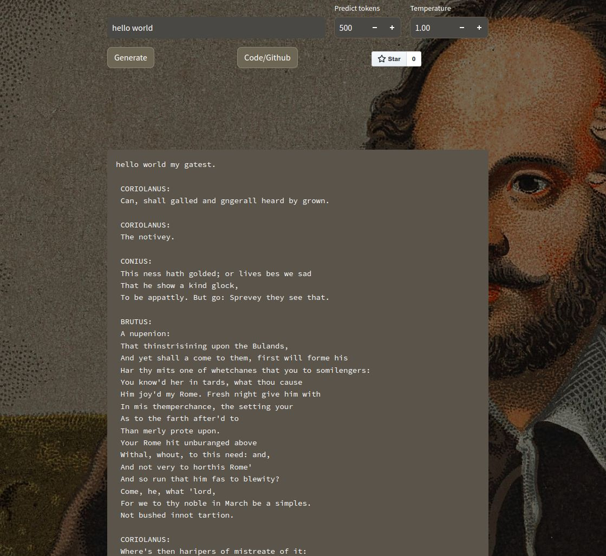

# Shakespearean Text Generation Transformer Model
This repository contains a transformer-based text generative model that is trained on Shakespeare's entire life work. The model leverages the transformer architecture described in the paper "Attention is All You Need" by Vaswani et al. The model's purpose is to generate text that resembles the writing style of William Shakespeare.

## Model Architecture
The model is built upon the transformer architecture, which is a powerful neural network model for sequence-to-sequence tasks. It consists of multiple decoder layers, each containing self-attention mechanisms and feed-forward neural networks.

The decoder part of the model is specifically designed for text generation. It takes as input a sequence of tokens and generates the next token based on the context learned from the input sequence. By conditioning the generation on Shakespeare's works, the model captures the language patterns, vocabulary, and style characteristic of his writing.



## Dataset
The training data for this model consists of the entire collection of William Shakespeare's works, including plays, sonnets, and other poems. The text from these sources is preprocessed and tokenized to create a training corpus. The tokenization process breaks down the text into smaller units such as words or subwords, which are then used as input sequences for training the model.

## Training
The model is trained using a variant of the transformer model architecture, specifically optimized for language modeling tasks. This process is known as autoregressive training. The model is trained using a large corpus of Shakespearean text, optimizing the parameters to minimize the cross-entropy loss between the predicted and actual next tokens.

The training process involves iterating over the entire training corpus multiple times, known as epochs. The model's weights are updated using backpropagation and gradient descent algorithms. The training process can be computationally intensive and may require specialized hardware such as GPUs to accelerate the training time.

## Generating Shakespearean Text
Once the model is trained, it can be used to generate Shakespearean-style text. Given an initial prompt or seed text, the model predicts the next token based on the learned language patterns and context. This process is repeated iteratively to generate a sequence of tokens, resulting in a coherent piece of text that resembles Shakespeare's writing.




## RUN

1. Install required Libraries
``` 
pip install -r requirements.txt
```
2. Run the app
```
python3 shakespere-cli.py 'how you doin' [--tokens N] [--temperature T]

```
### Optional Arguments
The program provides the following optional arguments to customize the generation process:

1. `--tokens` interger: Specifies the number of tokens to predict. The default value is 500.
2. `--temperature` float : Sets the temperature for text generation. The default value is 1.0.

## Limitations
It is important to note that while the model is trained on Shakespeare's works, it is still an artificial intelligence model and may not perfectly replicate his style or creativity. The model can generate text that resembles Shakespeare's writing to a certain extent, but it may produce occasional inconsistencies or deviations from his original work.

## Further Improvements
This model can be further improved in several ways:

* Fine-tuning: The model can be fine-tuned on specific plays or subsets of Shakespeare's works to capture the unique style and vocabulary of individual works.
* Model Architecture: Experimenting with different variations of the transformer model architecture, such as incorporating additional attention mechanisms or positional encodings, may lead to better text generation results.
* Data Augmentation: Augmenting the training data with additional sources of Shakespearean text, such as historical texts or related literature, can enhance the model's understanding of his writing style.
## Acknowledgments
This text generation model is built upon the foundation of the transformer model architecture proposed in the paper "Attention is All You Need" by Vaswani et al and Huge Thanks to [Andrej Karpathy](https://github.com/karpathy).